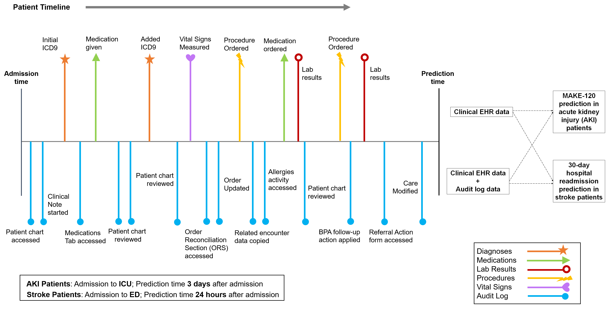

# Observational Supervision

Accompanying codebase for the paper "[Clinical outcome prediction using observational supervision with electronic health records and audit logs](https://www.sciencedirect.com/science/article/pii/S1532046423002435?via%3Dihub)" by **Nandita Bhaskhar**, Wui Ip, Jonathan H. Chen, and Daniel L. Rubin, published in the **Journal of Biomedical Informatics, 2023**.

<p align="center">
     <br>
</p>

Codebase structure inspired by `https://github.com/HealthRex/deployr-dev.git`

## Introduction

Audit logs in electronic health record (EHR) systems capture interactions of providers with clinical data. We determine if machine learning (ML) models trained using audit logs in conjunction with clinical data ("observational supervision") outperform ML models trained using clinical data alone in clinical outcome prediction tasks, and whether they are more robust to temporal distribution shifts in the data. 

Using clinical and audit log data from our hospital, we trained and evaluated various ML models including logistic regression, support vector machine (SVM) classifiers, neural networks, random forests, and gradient boosted machines (GBMs) on clinical EHR data, with and without audit logs for two clinical outcome prediction tasks: major adverse kidney events within 120 days of ICU admission (MAKE-120) in acute kidney injury (AKI) patients and 30-day readmission in acute stroke patients. We further tested the best performing models using patient data acquired during different time-intervals to evaluate the impact of temporal distribution shifts on model performance. 

Observational supervision with audit logs improved the performance of ML models trained to predict important clinical outcomes in patients with AKI and acute stroke, and improved robustness to temporal distribution shifts. Check out our paper for more details!


## Installation

- Clone the repo git clone https://github.com/nanbhas/ObservationalSupervision.git

- Create a new environment, note python version conda create -n ObsSup python=3.7.6

- Activate new env conda activate ObsSup

- Install healthrex_ml pip install -e .

- Install dependencies pip install -r requirements.txt

- Install lightbm (with conda) conda install lightgbm=3.1.1

## Updates
- __[10/15/2023]__ The code is currently being cleaned up for release. Please stay tuned for updates. If you'd like to access our code sooner, reach out to us via [email](#contact)

## Contact Us
<a name="contact"></a> 
This repository is being developed at Stanford's Rubin Lab. Please reach out to `nanbhas [at] stanford [dot] edu` if you would like to use or contribute to this project. 


## Citation

```bib
@article{bhaskhar2023_observational_supervision,
  title={Clinical outcome prediction using observational supervision with electronic health records and audit logs}, 
  author={Nandita Bhaskhar and Wui Ip and Jonathan H. Chenc and Daniel L. Rubin},
  journal={Journal of Biomedical Informactics (JBI)},
  year={2023}
}
```

